summary: Dynatrace SNMP 2.0 How To
id: dynatrace_snmp_2.0
categories: snmp
tags: snmp
status: Published 
authors: Arun Krishnan

# Dyntrace SNMP 2.0 How To

This repo walks you through the process of creating and testing a Dynatrace SNMP extension based off Extension 2.0 framework.

> **NOTE**: This documentation assumes that the reader has some basic understanding of SNMP and is familiar with snmp commands like `snmpget` amd `snmpwalk`. 

> Please note that this is not Dynatrace Official Documentation. Refer to [Extension 2.0 | Dynatrace Documentation](https://www.dynatrace.com/support/help/extend-dynatrace/extensions20/) for official documentation and latest changes. 

### Simple Network Management Protocol (SNMP)

SNMP is an Internet Protocol commonly used to gather performance metrics & alerts on network devices like Routers, Switch etc. SNMP can also be used to gather metrics from computers but is seldom used.

SNMP provides 2 capabilities:
-  SNMP Poll
-  SNMP Trap

**SNMP Poll** is the process by which an SNMP manager queries a target device for metrics. This is done by presenting an OID (Object Identifier) to the device and retrieving value corresponding to the OID. SNMP Poll is done to device port 161 of target device.

**SNMP Trap** is the process by which a device sends a notification to the SNMP manager. This is usually generated to notifiy the SNMP manager of some change on the device, like high resource utilization. SNMP Trap messages are received on port 162 of SNMP Manager.

Dynatrace currently supports SNMP Poll feature and SNMP Trap support is planned to be released in near future. 

<br/>

This documentation only covers **SNMP Poll**. 

<br/>

## Gather SNMP OIDs for extension

Dynatrace Extension 2.0 SNMP framework requires that you provide exact OIDs (Object Identifiers) for metrics you wish to monitor. This approach is different to other common SNMP managers where you can present an entire MIB file. 

### Terminology:

**OID (Object Identifier)**

An OID is a sequence of digits separated by '.' that refers to a particular metric on the device. 

For example, the OID `1.3.6.1.2.1.1.3.0` refers to `sysUpTime` which provides the Uptime of the device in Timeticks.

**MIB (Management Information Base)**:

A MIB is a file, provided by device manufacturer, that contains OIDs accepted by the device. A device usually has multiple MIBs focussing on certain set of metrics. For example, there can be a MIB with OIDs for resource metrics like CPU, Memory etc and another for interface metrics, and so on.

There are 2 types of MIBs:
- Generic MIBs that are common to all devices irrespective of make and model.
- Device specific MIBs that provide device specific metrics.

All MIBs accepted by a device are usually available to download from device management UI and/or the manufacturer website.

<br/>

### Reading MIB files

MIB files usually come with `.txt`, `.my` or `.mib` extensions, but can also depend on manufacturer. The common factor is that all MIBs should be readable in a text editor.

The MIB files usually provide OIDs in string format. In order to get the numeric format you may have to use a MIB browser software. 

iReasoning is an example for a popular MIB browser. Please visit [iReasoning Website](http://www.ireasoning.com/) for details.

<br/>

### Gathering required OIDs

Once you have all the relevant MIB files, its time to gather OIDs.

> TIP: Recommend writing down a list of metrics that are critical to monitor for your device before you begin. MIB files can contain thousands of OIDs and you can easily get lost looking though it. I have found writing down critical metrics helps maintain focus.

There are broadly two types of OIDs:

1. OIDs that return single values.
2. OIDs that return a table. 

**OIDs that provide single value**

These are the OIDs that provide a single return value - like Uptime, CPU, Memory etc. These metrics should be retrivable using a `snmpget` command.

Example:

 `snmpget -v 2c -c public 127.0.0.1 1.3.6.1.2.1.1.3.0` 

This particular query returns the UpTime of a device.

Breaking down the query:

`snmpget`: snmp command to gather a metric

`-v 2c`: Mentions we are using SNMP authenticaion version 2c

`-c public`: Community string for authenticaion

`127.0.0.1`: IP address of device

`1.3.6.1.2.1.1.3.0`: OID to gather details

> TIP: Recommend running both `snmget` and `snmwalk` on all OIDs. This way you can easily identify if the OID returns a table or single values. Sometimes you will find that you have to append a `.0` or `.1` to get a single value OID to get the value. This does not make it a table OID. 

<br/>

**OIDs that return a table**

These are the OIDs that return a table of data when queried. An example for this OID is the interface root OID `1.3.6.1.2.1.2.2.1`. These metrics are retrievable using `snmwalk` command.

Example:

`snmpwalk -v 2c -c public 127.0.0.1 1.3.6.1.2.1.2.2.1`

This particular query returns values like Index, Description, Type, MTU, Speed, InOctets, OutOctets etc for each interface on a device. If the device has 2 interfaces, each metric will be returned for both interfaces, but if the devices has 20 interfaces, each metric will be returned for all 20 interfaces and so on. The table size (values returned) depends on characteristics of the device.

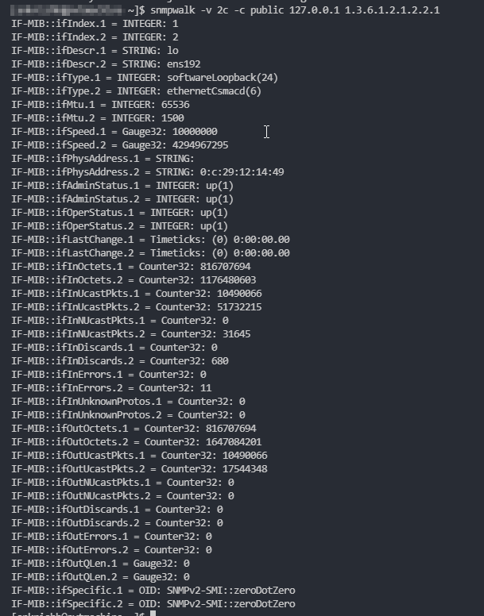

You will notice that an `snmpget` on this oid will return an error message as below.

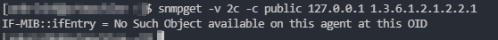


Device MIB documentation is the best way to identify if an OID returns a single value or a table.


<br/>

### OID details to note down during research

1. OID in number format. Eg: `1.3.6.1.2.1.1.3.0`
2. Whether the OID returns a single value or a table
3. The return variable type for each value (metric) returned
   
    Some common variable types are:
      - Counter32
      - Counter64   
      - INTEGER
      - Gauge32
      - Gauge64
      - STRING  
      - Timeticks

    This can be seen in the result of an `snmpget` or `snmwalk` command. See highlighted in below result.

    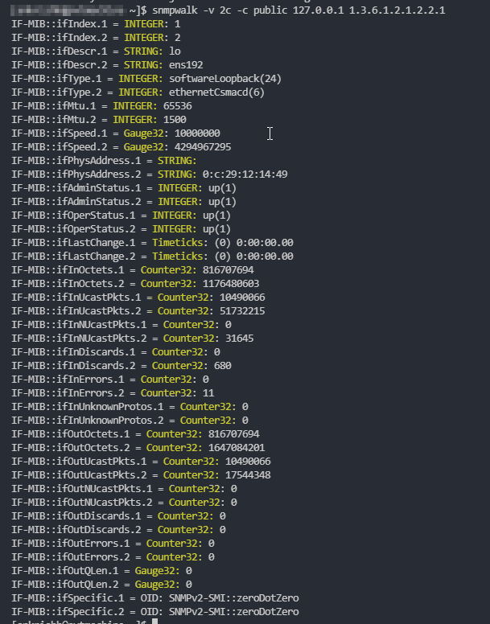


<br/>

## Prepare extension.yaml

Dynatrace Extension Framework 2.0 provides the capability to define extension configuration as a `.yaml` file. In this page, you will learn how to prepare `extension.yaml` file rquired for SNMP monitoring.

> Please read official [Extensions 2.0 concepts](https://www.dynatrace.com/support/help/shortlink/extensions-concepts) for how the extension works.

> This documentation does not require a deep understanding of `yaml` file structure but recommend light reading on the topic.

<br/>

### Extension folder structure

Please structure your extension working directory as below (required):

```
SNMP
 |
 --> Cisco                      # OK to rename with your device name
        |
        --extension             # DO NOT rename
             |
             -- extension.yaml  # DO NOT rename

```

<br/>

### YAML file

The `extension.yaml` file follows below basic structure:


```yaml
name: <value>               
version: <value>
minDynatraceVersion: <value>
author:
  name: <value>

metrics:
- key: <value>
   metadata:
      displayName: <value>
      description: <value>
      unit: <value>
- key: <value>
   metadata:
      displayName: <value>
      description: <value>
      unit: <value>

snmp:
- group: <value>
  interval: <value>
  
  dimensions:
  - key: <value>
    value: <value>

  subgroups:
    - subgroup: <value>
      table: false    
      metrics:
        - key: <value>
          value: oid:<value>
          type: <value>
    - subgroup: <value>
      table: true
      dimensions:
        - key: <value>
          value: <value>
      metrics:
        - key: <value>
          value: oid:<value>
          type: <value>

```

Each parameter in order shown above:

`name`: A name for the extension. This have to be in the format `custom:<your_chosen_name>`. Example: `custom:cisco_router_snmp`

`version`: This is the your extension iteration version. Example: `1.0.0` and go up as `1.1.0`, `1.2.0` and so on as you update the extension.

`minDynatraceVersion`: Earliest version of Dynatrace Server this extension can run on. For the purpose of this documentation please use `"1.217"`

<br/>

`author`

  `name`: Company/your name.

<br/>

`metrics`: In this section you define metadata like name, description, unit for your metrics. 

  `key`: This is a unique identifier for your metric. Example: `custom.cisco.switch.cpu.usage.5second`. Please see [Metric key](https://www.dynatrace.com/support/help/shortlink/metric-ingestion-protocol#metric-key-required) for format restrictions.

  `name`: A friendly name for your metric. Example "CPU Usage % - 5secs"

  `description`: A description for your metric

  `unit`: Unit for your metric. Example Percentage, Byte, Count etc. For full list of available Units see `Unit` parameter under [Response body > Response parameters (tab) > The MetricDescriptor object > unit > the element can hold these values](https://www.dynatrace.com/support/help/shortlink/api-metrics-v2-get-all#response)

<br/>

`snmp`: In this section all required metrics are organized in groups and subgroups. Indivual and Table OIDs have to specified in separate subgroups.

`group`: A group of metrics. Please see [Groups and subgroups](https://www.dynatrace.com/support/help/shortlink/extension-yaml#groups-and-subgroups) for details.

`interval`: Frequecy of SNMP polling. Examples: 1m, 5m etc. Please see [Interval](https://www.dynatrace.com/support/help/shortlink/extension-yaml#interval) for details.

`dimensions`: Your dimension value. An analogy for dimension is - If 'City' is the Dimension, then 'London', 'New York', 'Auckland' etc are some dimension values. A common dimension for SNMP is the device IP address. 

A dimension provides the ability to filter metrics. For example, if you want to see CPU breakdown per device, you can specify IP address as a dimension and then use it to 'split' or 'filter' results. Please see [Dimension](https://www.dynatrace.com/support/help/shortlink/metric-ingestion-protocol#dimension-optional) for more details.

Multiple dimensions can be defined.

`key`: A unique key for your dimension. Examples: `this:device.address`, `device:name`. Please note that keys cannot have Uppercase characters. 

`value: oid:`: This is where you tell extension where to pick up Dimension values. Examples: `this:device.address` - value based on extension configuration & `1.3.6.1.2.1.1.5.0` - value from OID

`subgroups`: Required OIDs are organized into separate subgroups.

`metrics`

`key`: The unique values here are the same 'keys' from root `metrics` where you defined metadata for the key. So the same `key` appears twice in the extension.
1. under root `metrics` and
2. under `snmp` > `group` > `subgroups` > `metrics`

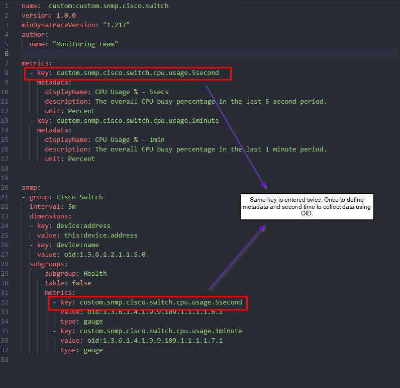

Other Unique items in this section that were not discussed earlier are `table` and `type`

`table`: This tells the extension if the OIDs are to be treated as individual OIDs or table OIDs. Acceptable values are `true` or `false`

`type`: Dynatrace supports two metric types - `gauge` and `count` metrics. Please see [Payload](https://www.dynatrace.com/support/help/shortlink/metric-ingestion-protocol#payload-required) for details on these types. Below is a generic rule I follow.

If `snmpget` or `snmpwalk` of an OID returns the variable type as `Counter32` or `Counter64`, then 'type' is `Count` and if the return variable type is anything **EXCEPT** `STRING`, type is `Gauge`

`STRING` variable types can **ONLY** be dimensions. String values cannot be sent to Dynatrace as a metric.

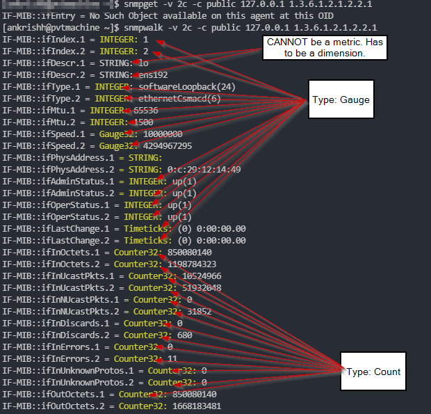

<br/>

### Example extension

Here is a full example of an extension to monitor Cisco Network Switches.
 
> Please note that this extension has not been tested for all Cisco switches. The OIDs may vary between models.

```yaml
name:  custom:custom.snmp.cisco.switch
version: 1.0.0
minDynatraceVersion: "1.217"
author:
  name: "Monitoring team"
metrics:
  - key: custom.snmp.cisco.switch.uptime
    metadata:
      displayName: System uptime
      description: System uptime
      unit: Count
  - key: custom.snmp.cisco.switch.cpu.usage.5second
    metadata:
      displayName: CPU Usage % - 5secs
      description: The overall CPU busy percentage in the last 5 second period.
      unit: Percent
  - key: custom.snmp.cisco.switch.cpu.usage.1minute
    metadata:
      displayName: CPU Usage % - 1min
      description: The overall CPU busy percentage in the last 1 minute period.
      unit: Percent
  - key: custom.snmp.cisco.switch.cpu.usage.5minutes
    metadata:
      displayName: CPU Usage % - 5mins
      description: The overall CPU busy percentage in the last 5 minute period.
      unit: Percent
  - key: custom.snmp.cisco.switch.memory.used
    metadata:
      displayName: Memory Used
      description: The overall CPU wide system memory which is currently under use.
      unit: KiloByte
  - key: custom.snmp.cisco.switch.memory.free
    metadata:
      displayName: Memory Free
      description: The overall CPU wide system memory which is currently free.
      unit: KiloByte  
  - key: custom.snmp.cisco.switch.ifHCInOctets
    metadata:
      displayName: Interface Traffic - In (IfXTable)
      description: The total number of octets received on the interface.
      unit: Byte
  - key: custom.snmp.cisco.switch.ifHCOutOctets
    metadata:
      displayName: Interface Traffic - Out (IfXTable)
      description: The total number of octets transmitted out of the interface.
      unit: Byte  
  - key: custom.snmp.cisco.switch.ifOperStatus
    metadata:
      displayName: Interface operational status 
      description: The current operational state of the interface. (1)up,(2)down,(3)testing,(4)unknown,(5)dormant,(6)notPresent,(7)lowerLayerDown
      unit: State
  - key: custom.snmp.cisco.switch.ifInOctets
    metadata:
      displayName: Interface traffic - In 
      description: The total number of octets received on the interface.
      unit: Byte
  - key: custom.snmp.cisco.switch.ifOutOctets
    metadata:
      displayName: Interface traffic - Out
      description: The total number of octets transmitted out of the interface.
      unit: Byte  
  
snmp:
- group: Cisco Switch
  interval: 5m
  dimensions:
  - key: device:address  
    value: this:device.address
  - key: device:name    
    value: oid:1.3.6.1.2.1.1.5.0
  subgroups:
    - subgroup: Health
      table: false      
      metrics:
        - key: custom.snmp.cisco.switch.uptime
          value: oid:1.3.6.1.2.1.1.3.0
          type: gauge
        - key: custom.snmp.cisco.switch.cpu.usage.5second
          value: oid:1.3.6.1.4.1.9.9.109.1.1.1.1.6.1
          type: gauge
        - key: custom.snmp.cisco.switch.cpu.usage.1minute
          value: oid:1.3.6.1.4.1.9.9.109.1.1.1.1.7.1
          type: gauge
        - key: custom.snmp.cisco.switch.cpu.usage.5minutes
          value: oid:1.3.6.1.4.1.9.9.109.1.1.1.1.8.1
          type: gauge
        - key: custom.snmp.cisco.switch.memory.used
          value: oid:1.3.6.1.4.1.9.9.109.1.1.1.1.12.1
          type: gauge
        - key: custom.snmp.cisco.switch.memory.free
          value: oid:1.3.6.1.4.1.9.9.109.1.1.1.1.13.1
          type: gauge   
    

    - subgroup: IF XTable
      table: true
      dimensions:
        - key: cisco:interface-name
          value: oid:1.3.6.1.2.1.31.1.1.1.1
        - key: cisco:interface-alias
          value: oid:1.3.6.1.2.1.31.1.1.1.18
      metrics:
        - key: custom.snmp.cisco.switch.ifHCInOctets
          value: oid:1.3.6.1.2.1.31.1.1.1.6
          type: count
        - key: custom.snmp.cisco.switch.ifHCOutOctets
          value: oid:1.3.6.1.2.1.31.1.1.1.10
          type: count
    
    - subgroup: IF Table
      table: true
      dimensions:
        - key: cisco:interface-index
          value: oid:1.3.6.1.2.1.2.2.1.1
        - key: cisco:interface-descr
          value: oid:1.3.6.1.2.1.2.2.1.2        
      metrics:
        - key: custom.snmp.cisco.switch.ifOperStatus
          value: oid:1.3.6.1.2.1.2.2.1.8
          type: gauge        
        - key: custom.snmp.cisco.switch.ifInOctets
          value: oid:1.3.6.1.2.1.2.2.1.10
          type: count
        - key: custom.snmp.cisco.switch.ifOutOctets
          value: oid:1.3.6.1.2.1.2.2.1.16
          type: count

```


<br/>

Once `extension.yaml` is ready, its time to package the extension to a zip file.

## Sign Extension

The next step in extension creation process is to Sign your extension with a certificate and make it ready for use.

> NOTE: This page describes generating and signing an extension using Dynatrace Open Source [dt-cli](https://github.com/dynatrace-oss/dt-cli) utility. Please see [Sign extension](https://www.dynatrace.com/support/help/shortlink/sign-extension) official documentation for manual step by step instructions.

<br/>

### Python install

`dt-cli` is a Python utility and therefore requires Python installed on your computer before you can use it.

> This document describes Python installation on Windows OS but steps are similar for other Operating Systems.

1. [Download Python - v3.9+](https://www.python.org/downloads/)
   
   Dowload Python v3.9+ from [Python official Downloads page](https://www.python.org/downloads/)

   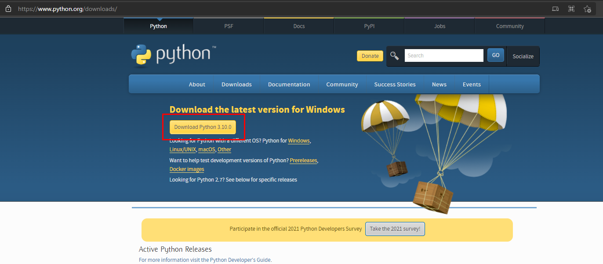

2. Install Python

    Open downloaded `.exe` file, select 'Add Python 3.10 to PATH' checkbox and then click `Install Now`

    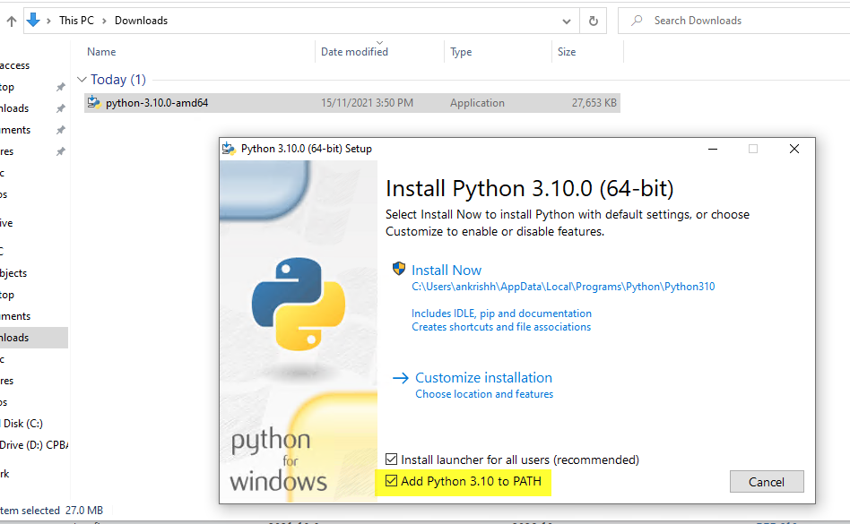

    Wait for the installation to complete successfully and click close.

    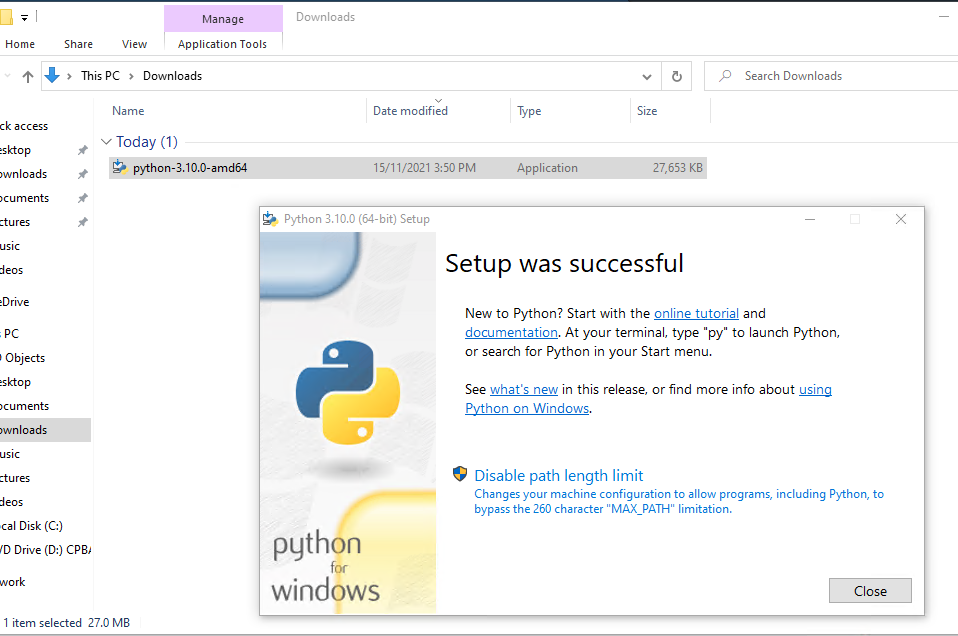

3. Open a PowerShell.exe terminal and confirm installation successful.

    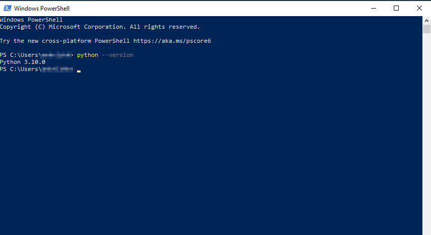

<br/>

### dt-cli install

1. From your PowerShell terminal run `pip install dt-cli`. This will download the `dt-cli` utility onto your computer.

    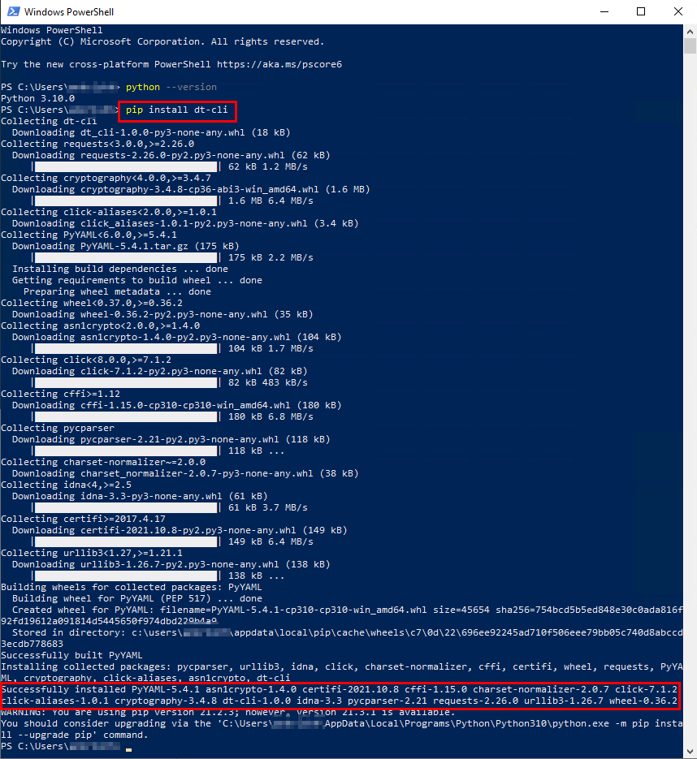

2. Confirm success by running `dt --help`

    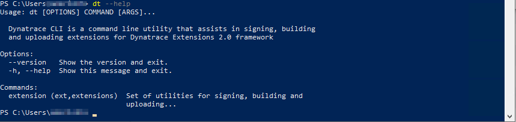

<br/>

### Generate certficates and sign extension

Change terminal path to your directory that has the 'extension' folder. Then run `dt extension gencerts` - Leave all entries blank by hitting 'Enter' key. 

This generates the CA and Developer Certificates and Keys required to sign the extension.

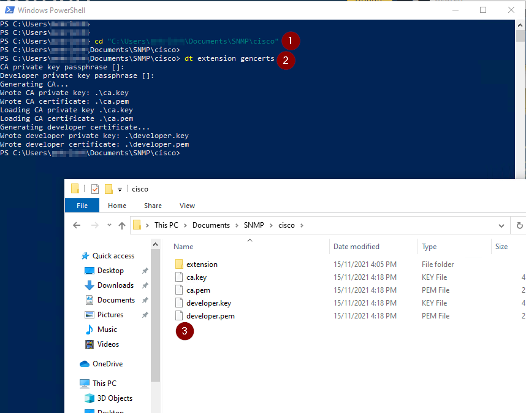

<br/>

Next, sign extension by running `dt extension build`. This command uses the generated certificates to sign the extension and generate a zip file.

<br/>

### Upload `ca.pem` to ActiveGates

The CA certificate used to sign an extension has to be present on all ActiveGates from which the extension is to run. 

If there are multiple ActiveGates in a tenancy, Dynatrace chooses an ActiveGate to run the extension based on ActiveGate group specified in Monitoring configuration (we will be looking at this later).

Copy `ca.pem` file to following ActiveGate directory on respective OS.

Windows: `%PROGRAMDATA%\dynatrace\oneagent\agent\config\certificates\`

Linux: `/var/lib/dynatrace/oneagent/agent/config/certificates`

<br/>

### Assign a group to your ActiveGate

During SNMP monitoring setup, there is the option to select ActiveGate 'Group' to run the extension. All ActiveGates out of the box belong to 'default' group. If you would like the extension to run from a subset of your ActiveGates, a group has to be defined.

To add an ActiveGate to a group, specify 'group' parameter in ActiveGate `custom.properties` file and restart Dynatrace ActiveGate service.

Location of custom.properties file:

Windows: `%PROGRAMDATA%\dynatrace\gateway\config\custom.properties`

Linux: `/var/lib/dynatrace/gateway/config/custom.properties`

<br/>

Content to add in `custom.properties`:

```bash
[collector]
group = snmp_extension      # Feel free to chose another group name 
```

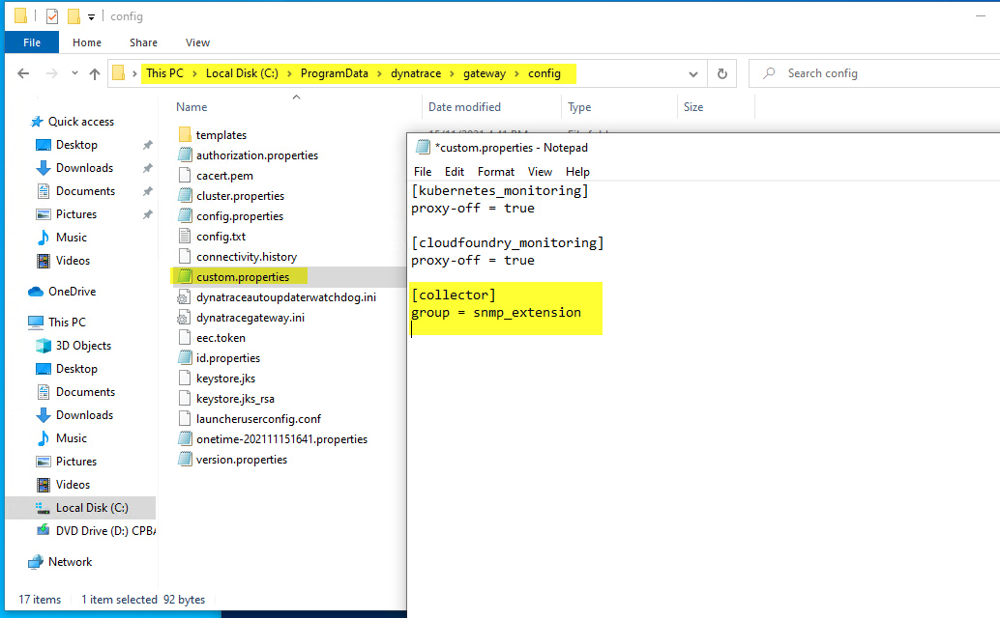

Once ActiveGate service is restarted, the new group name should appear in ActiveGate properties under `Deployment Status > ActiveGates > <your_activeGate>`.

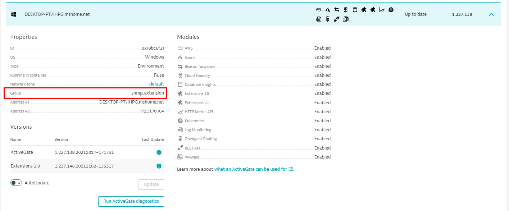

<br/>

### Upload `ca.pem` to Dynatrace Tenancy

`ca.pem` file has to be uploaded to tenancy as well. This is for Dynatrace to verify the integrity of extensions that are uploaded.

Navigate to `Settings > Web and mobile monitoring > Credential vault` and click `Add new credential`.

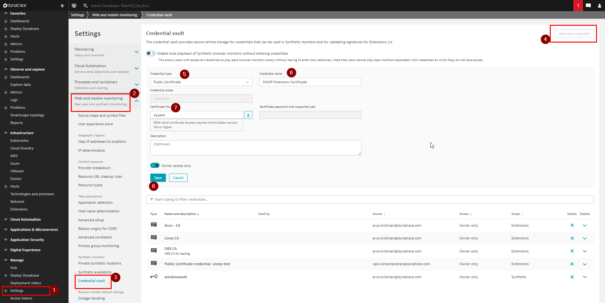


<br/>


## Upload extension to tenancy and setup monitoring

Extension upload and monitoring configuration can be done via both UI and API. This document covers the UI method. If you are interested in doing these through API please refer to [Manage Extension 2.0 lifecycle](https://www.dynatrace.com/support/help/shortlink/extension-lifecycle)

### Upload extension

1. Navigate to `Manage > Hub > Extension 2.0 in your environment` and click on `Upload custom Extesion 2.0` 

    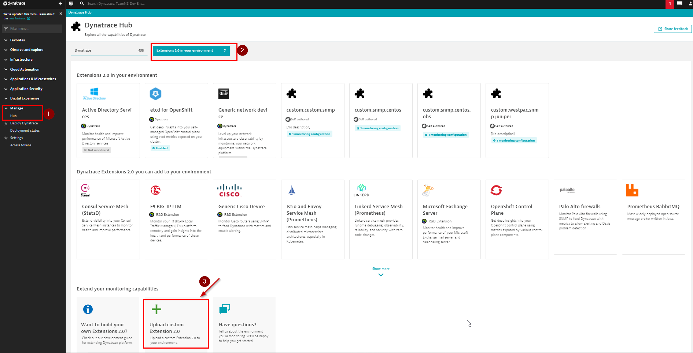

<br/>

2. Upload your extension to the page with relevant details

    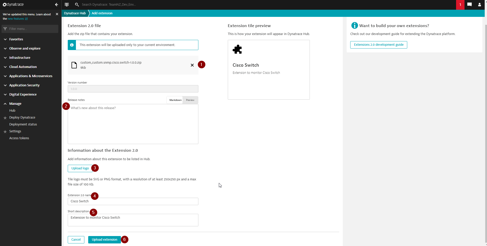

<br/>

3. Upload extension takes you to the configuration page.

    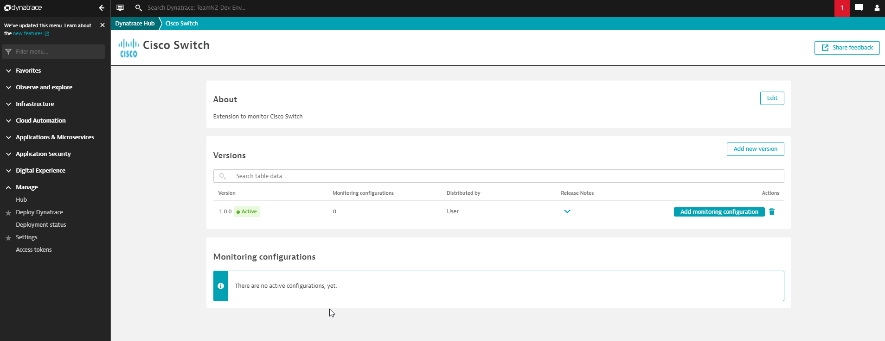


<br/>

### Configure extension endpoints

You get to the configuration page right after you upload the extension or by navigating to `Manage > Hub > Extension 2.0 in your environment > Your extension`

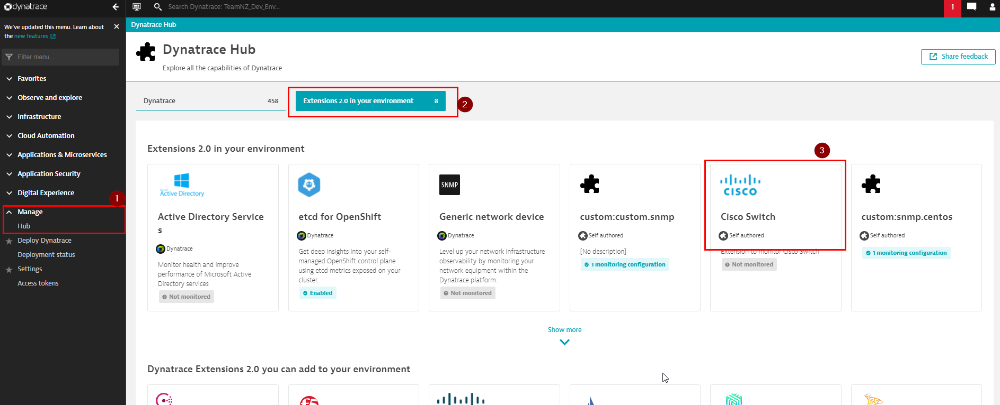

<br/>

Once on configuration page, follow below steps providing relevant details on each page.

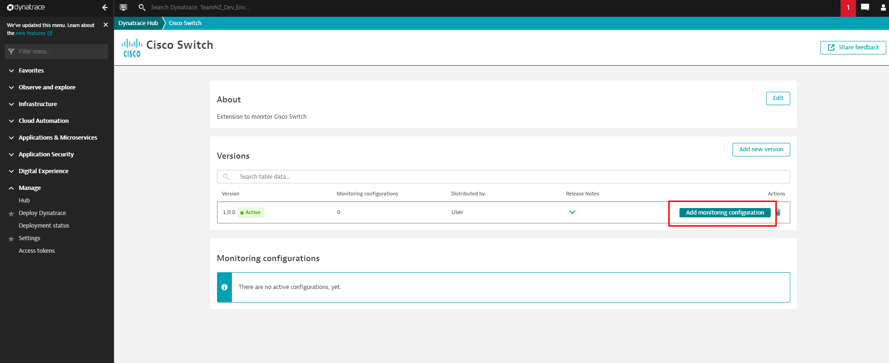

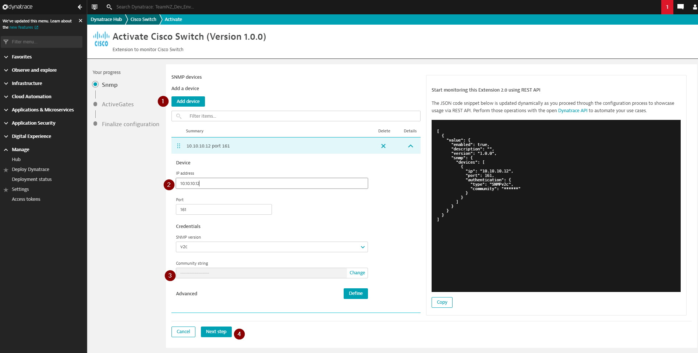

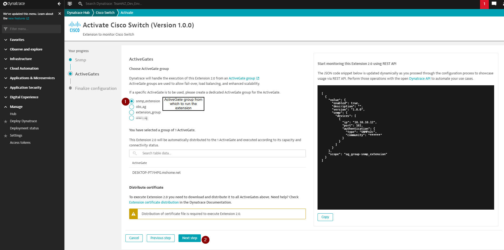

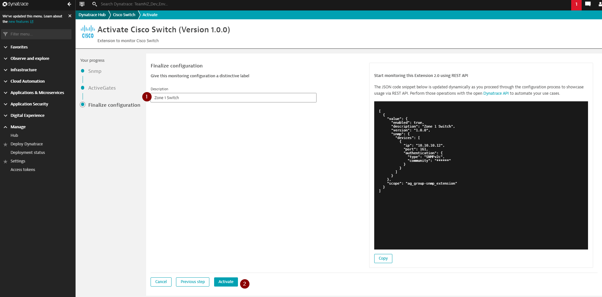

<br/>

Once saved the configuration should show as active.

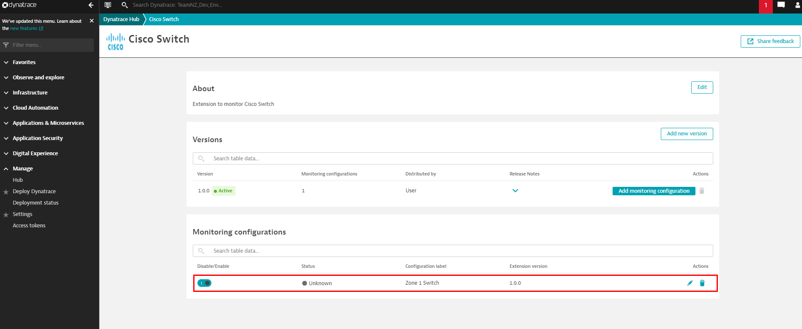

<br/>

Add more monitoring configuration/devices as required.

<br/>

## Check metrics and chart

Once extension successfully connects to your device, metrics should start appearing under `Metrics` view in UI. You can focus on just your metrics by filtering with metric key name.

> Please note metrics can take upto 5 minutes to appear after first setup.

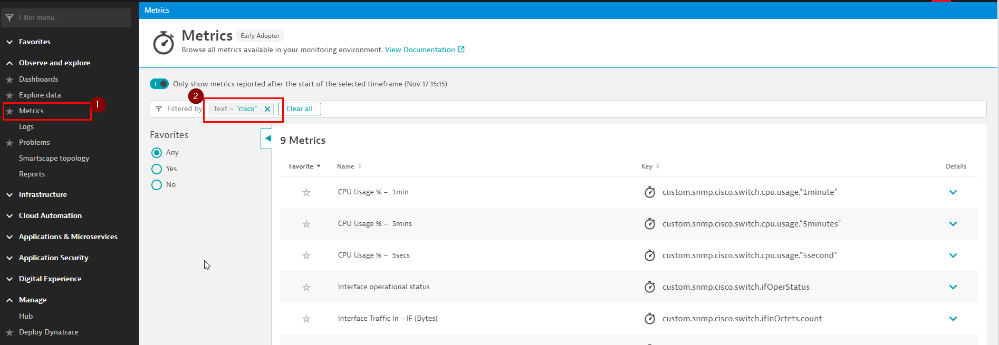

<br/>

### Metadata for 'count' metrics

You will notice that metrics for which you had defined 'type: count' (i.e Counter metrics) don't show the metadata you had defined for it in the extension. Instead, they just show up with the full key name. 

This is a known issue and can be fixed by manually editing the metadata for the metric as below.

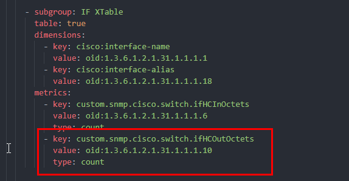

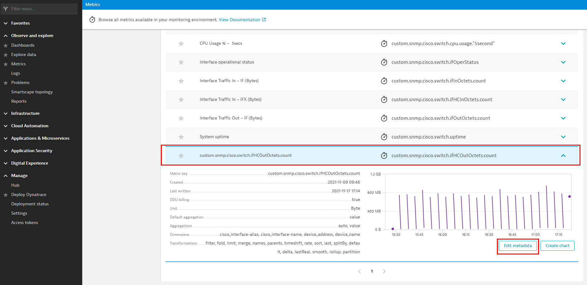

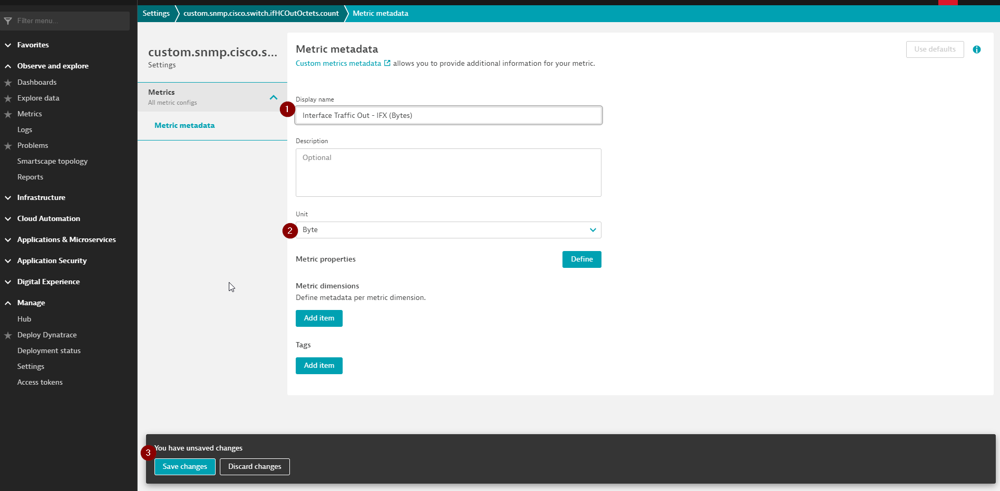

<br/>

### Chart metrics

From this point all metrics can be charted as usual using Dynatrace Data Explorer.

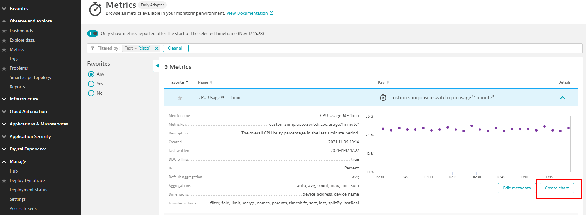

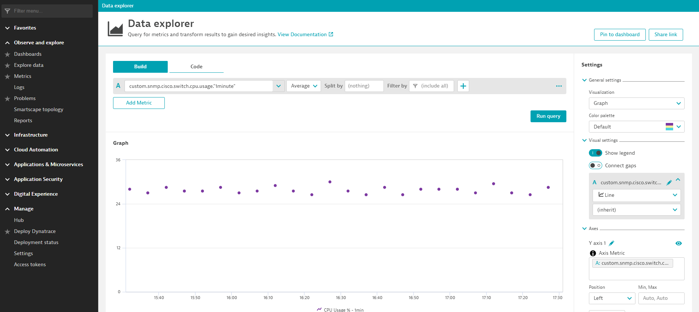


<br/>

## Troubleshooting

1. Issues during upload

    Fix: Upload `ca.pem` certificate to tenancy

    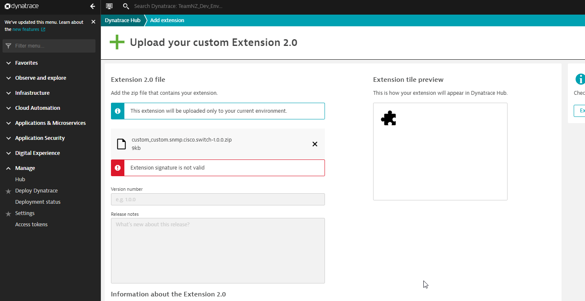


2. Metrics don't show after endpoints are setup

    Reason: SNMP Poll to device is not running as expected. 

    Fix: Check logs at below location to learn more (On ActiveGates in Extension group)

    Windows: `%PROGRAMDATA%\dynatrace\remotepluginmodule\log\extensions`

    Linux: `/var/lib/dynatrace/remotepluginmodule/log/extensions`

<br/>

For more details refer to [Extensions 2.0 official documentation](https://www.dynatrace.com/support/help/shortlink/extensions20)


